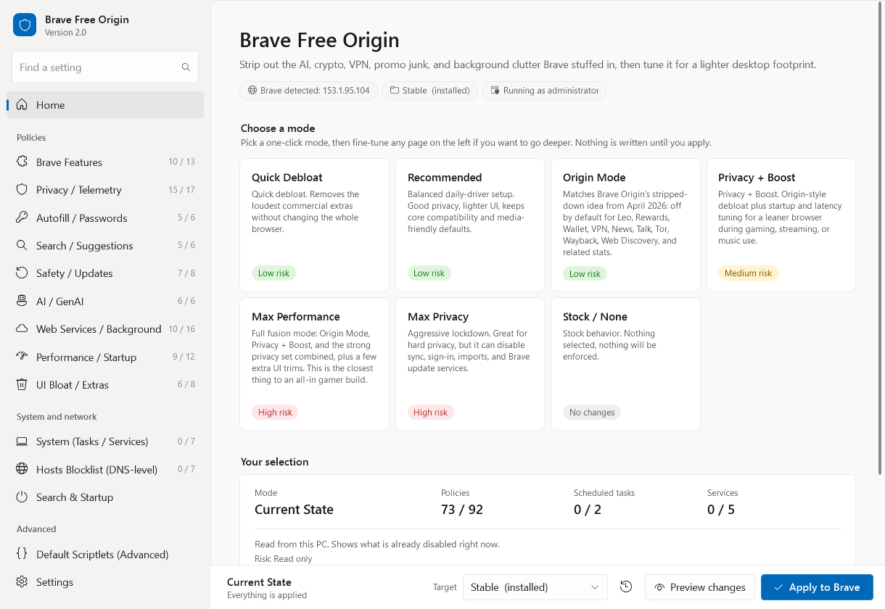

# Brave Free Origin (v1.12)

[简体中文](README.zh-CN.md)

`Brave Free Origin` is a Windows GUI tool that turns normal Brave into a leaner, stripped-down build without paying for Brave Origin.

The point is simple: Brave took the "remove the AI, crypto, VPN, promo junk" idea, called it Origin, and put it behind a paid upgrade. This project does the local Windows policy version of that idea for free, and then goes further with extra performance-focused modes.

It is inspired by [MulesGaming/brave-debullshitinator](https://github.com/MulesGaming/brave-debullshitinator), but reshaped into a cleaner WinForms app with one-click modes, screenshots, backups, and a more normal Windows-user flow.



**New in v1.12:** the interface is translatable (Simplified Chinese included),
and there is a search box that filters every setting at once. See
[TRANSLATING.md](TRANSLATING.md) if you want to add your language — it is one
JSON file, no PowerShell required.

---

## Quick Start (read this first)

**1. Extract the whole folder out of the ZIP.** Don't try to run anything from inside the ZIP — Windows blocks PowerShell scripts launched from compressed archives.

**2. Double-click `Brave-Free-Origin.bat`.**

That is the launcher. It opens PowerShell with the right execution-policy flag and asks Windows for administrator permission.

> ⚠️ **Important:** do **not** double-click `Brave-Free-Origin.ps1` directly. Windows opens `.ps1` files in Notepad by default — the GUI will *not* appear and you will think the tool is broken. **Always use the `.bat`.**

**3. Click "Yes" on the UAC prompt.** Admin rights are required because the tool writes to `HKEY_LOCAL_MACHINE\Software\Policies\BraveSoftware\Brave` — the same place corporate IT writes group policies. No admin = no policies = nothing happens.

**4. In the GUI, click `Load current state`** (top-left) if you want to see what's already configured on your machine. The boxes light up to show what is already enforced.

**5. Pick a mode** in the colored button row at the top:

| Button | What it does |
|---|---|
| **Quick Debloat** | Lightest cleanup. Removes the loudest extras (Rewards, Wallet, VPN, AI, password manager). Safest. |
| **Recommended** | Sensible daily-driver setup. Good privacy + lighter UI + media-friendly defaults. |
| **Origin Mode** | The free local answer to Brave's paywalled "Origin" build. |
| **Privacy + Boost** | Origin Mode + startup and latency tuning. The performance default. |
| **Max Performance** | Origin + Boost + Max Privacy unioned + extra UI trims. Aggressive. |
| **Max Privacy** | Hard lockdown — disables sync, sign-in, imports, Brave update services. |
| **Stock / None** | Unticks everything. Click `Apply to Brave` after to revert to default Brave. |

**6. (Optional) Tweak the tabs** below the buttons if you want to add/remove individual policies.

There is also a `Default Scriptlets (Advanced)` tab. That is a separate optional tool for viewing Brave's built-in adblock scriptlet rules and manually disabling selected ones. Presets and the big `Apply to Brave` button never touch it.

**7. Click `Preview changes`** before applying. It shows exactly what will be added, changed, cleared, disabled, or reset. Nothing is written from Preview.

**8. Click `Apply to Brave`** (the big green button). Then **fully close and reopen Brave** — running tabs need a restart to pick up the new policies.

**8b. (Optional) Use the filter bar** above the tabs to find a setting fast.
Type any part of a policy name, its description or its category — `password`,
`telemetry`, `BraveVPNDisabled` — and every tab collapses to just the matches,
with a live count on each tab caption. Tick **Selected only** after picking a
mode to review exactly what that preset is about to enforce, and nothing else.

The filter is **presentational only**: it hides and re-flows rows, and never
ticks, unticks or otherwise changes a single setting. `Clear` restores every
row. It covers the nine policy tabs, `System (Tasks / Services)` and
`Hosts Blocklist`; `Search & Startup` and `Default Scriptlets` are not indexed
by it (Scriptlets has its own scanner and search box, tuned for thousands of
rows), so those two tab captions never show a match count.

**9. (Recommended)** Click the `Verify` button in the app. It reads the registry back and confirms your selections actually landed. You can copy or save the report. Or open `brave://policy` and check that each policy shows `Source: Platform`, `Scope: Machine`, `Status: OK`.

### Changing the language

Use the **Language** dropdown in the top-right of the header. The change is
live — no restart — and is remembered in
`%LOCALAPPDATA%\Brave-Free-Origin\settings.json`.

You can also force it from the command line, which is handy for testing:

```powershell
.\Brave-Free-Origin.ps1 -Lang zh-CN
```

If you never touch the dropdown, the app follows your Windows display language.
Resolution order is: `-Lang`, then the saved preference, then the Windows UI
culture, then a same-language file, then English.

The same-language step will not cross writing systems. A `zh-CN`, `zh-SG` or
`zh-Hans-*` Windows gets Simplified Chinese; a `zh-TW`, `zh-HK`, `zh-MO` or
`zh-Hant-*` Windows stays in **English** unless a Traditional Chinese locale
file is actually installed, because Simplified text is not a usable
substitute. You can always pick any installed language from the dropdown.

Diagnostic output stays in English on purpose: the log pane, the **Preview
changes** report and the **Verify** report. That way a translated install still
produces bug reports the maintainer can read. A handful of on-screen strings
are also deliberately untranslated — policy names, scheduled task and service
names, registry paths, domains, URLs, raw filter rules and scriptlet
identifiers — because they are things you cross-check against
`brave://policy`, `services.msc` or Brave's own filter lists.

### Files in this folder

```
Brave-Free-Origin/
├── Brave-Free-Origin.bat   ← double-click THIS one
├── Brave-Free-Origin.ps1   ← never double-click this (opens in Notepad)
├── README.md               ← you are here
├── README.zh-CN.md
├── TRANSLATING.md          ← how to add a language
├── LICENSE
├── locales/
│   ├── en-US.json          ← generated reference, never loaded at runtime
│   └── zh-CN.json          ← Simplified Chinese
└── images/
    ├── screenshot.png      ← GUI preview shown above
    ├── Brave-before.png    ← memory comparison: before
    └── Brave-after.png     ← memory comparison: after
```

Deleting `locales/` is harmless — the English catalog is embedded in the
script, so the app simply runs in English.

The launcher (`.bat`) is essentially one line: it runs the PowerShell script with `-ExecutionPolicy Bypass`. That bypass is scoped only to that single launch — it does **not** weaken your machine's PowerShell policy.

---

<details>
<summary><strong>📜 Changelog (click to expand)</strong></summary>

### What's new in v1.12

Two user-facing features, and a large internal refactor that had to land first.

- **Translatable interface.** A `Language` dropdown in the header switches the
  whole UI live. Simplified Chinese (`zh-CN`) ships in the box — support added
  in response to [#4](https://github.com/TahaHydra/Brave-Free-Origin/issues/4),
  opened by [@A81N9](https://github.com/A81N9). The Chinese wording has **not**
  been reviewed by a native speaker yet, so `locales/zh-CN.json` carries
  `"reviewed": false` and the app shows a small *community translation,
  unreviewed* note under the picker. Review PRs are very welcome.
  Adding a language is one JSON file — see [TRANSLATING.md](TRANSLATING.md).
- **Global configuration filter.** A search box above the tabs filters
  policies, scheduled tasks, Windows services and hosts groups at the same
  time, matching on name, description and category — in whichever language the
  UI is currently in, and on the untranslated policy identifier either way.
  Hidden rows collapse instead of leaving gaps, each tab caption shows its
  match count, and the view jumps to the first tab with a hit. Filtering is
  purely presentational: it never changes a selection. A **Selected only**
  checkbox shows just what is currently ticked — pair it with a preset to
  review exactly what is about to be enforced. `Search & Startup` and the
  Scriptlets tab are not part of this index; Scriptlets keeps its own
  dedicated scanner, which handles thousands of rows and is already tuned.
- **Stable internal ids, separated from labels.** Presets, hosts groups,
  search engines, new-tab destinations, startup modes, policy categories and
  the channel selector previously used their English display text as the
  lookup key. Translating the UI would have silently broken preset behaviour
  and config import. Everything now keys off a language-independent id and the
  visible label is looked up separately.
- **Config schema v2.** Exports now carry `schemaVersion` (the file format)
  and `appVersion` (the app) as separate fields, so gaining a button no longer
  looks like a format change. Hosts groups, search engines, new-tab
  destinations and startup modes are stored by id. **Configs exported by
  v1.5-v1.11 still import correctly** — the old English names are mapped on
  the way in. A config exported in Chinese imports identically in English and
  vice versa.
- **`-Lang` and settings survive elevation.** The relaunch after the UAC
  prompt used to rebuild a fixed command line and drop every parameter. It now
  forwards `-Lang` and the resolved settings path, so an elevated
  administrator account still reads the original user's preference file.
- **Switching language changes nothing but text.** Relabelling a dropdown
  means clearing and refilling its items, and WinForms reports that as a user
  selection change — which would have quietly demoted `Recommended` to
  `Custom` and could have moved the hardware-acceleration value. Every bulk
  update (language switch, preset, config import, *Load current state*, full
  restore) now runs with the change handlers muted, restores the exact
  selected id, and re-asserts the active mode afterwards.
- **CJK layout handling.** Microsoft YaHei UI is used for `zh-*` when
  installed, with taller rows and a larger description font, and every
  localized control re-resolves its font on a switch instead of staying pinned
  to Segoe UI, which has no CJK coverage. Row geometry is recalculated from
  the *active* locale in both directions, so going back to English shrinks the
  rows again rather than leaving tall labels inside short rows. The preset
  button row measures its captions and re-flows instead of using fixed X
  positions, so a longer translated label cannot overlap its neighbour.
- **Traditional Chinese is never served Simplified.** Locale matching is
  script-aware: `zh-CN` / `zh-SG` / `zh-Hans-*` resolve to `zh-CN`, while
  `zh-TW` / `zh-HK` / `zh-MO` / `zh-Hant-*` fall back to English until a
  Traditional Chinese file exists.
- **The script stays pure ASCII.** Windows PowerShell 5.1 decodes a BOM-less
  `.ps1` with the system ANSI code page, so literal Chinese in the app would
  mojibake on machines with a different code page. Translations live in
  `locales\*.json` and are read with an explicit UTF-8 decoder.
- **Community locale files are treated as hostile data.** A file dropped into
  `locales\` by hand is parsed as inert JSON — never executed, never through
  `Invoke-Expression` or `Import-LocalizedData`. It may only replace keys
  English already defines, so it cannot introduce a registry path, policy
  name, domain, URL or numeric value. Unknown keys, non-strings, over-long
  values, control characters and mismatched `{0}` placeholders are rejected
  key by key and fall back to English; a malformed or invalid file leaves the
  app in English instead of crashing it.
- **Locale tooling and CI.** `tools\Test-Locales.ps1` validates encoding,
  JSON, duplicate keys, unknown keys, placeholder parity, escaped braces,
  control characters, value length and metadata.
  `tools\Export-EnglishLocale.ps1` regenerates `locales\en-US.json` from the
  embedded catalog by parsing the app's syntax tree — it never executes the
  app — and writes byte-identical output under Windows PowerShell 5.1 and
  PowerShell 7. CI runs both tools under **Windows PowerShell 5.1**, which is
  what the launcher actually uses, as well as under PowerShell 7, and enforces
  the ASCII rule, the locale encoding rules and the portable-zip contents.

Behaviour is otherwise unchanged: the same policies, the same registry writes,
the same hosts handling. Every preset's policy / task / service / hosts payload
was diffed against v1.11 as part of this release and is identical once the
hosts groups are mapped from their old English names to the new ids, as are the
search-provider names, URLs, suggest URLs, keywords, homepages, new-tab
destination values and `RestoreOnStartup` codes that reach the registry. The
Scriptlets tab remains manual-only: it is never touched by a preset, by
`Apply to Brave`, or by anything that runs at startup. If you find any
difference in what gets applied between v1.11 and v1.12, that is a bug —
please open an issue.

One genuine fix landed alongside: the 32-bit `Program Files (x86)` probe for
`brave.exe` was written `"$env:ProgramFiles(x86)\..."`, which PowerShell
expands as `$env:ProgramFiles` followed by a literal `(x86)`, so it could
never match. It is now `"${env:ProgramFiles(x86)}\..."`.

### What's new in v1.11

This fixes the scriptlet scan hang from v1.10.

- **Chunked in-app scanner.** Replaces the background-job scan with a timer-based chunk scanner, avoiding the slow PowerShell job serialization step that could sit on `Loading scriptlet scan results...` for minutes.
- **Real progress bar.** The Scriptlets tab now shows a blue progress bar and live status based on files/bytes processed, current file, elapsed seconds, and rules found.
- **Responsive during scan.** The scan yields back to the GUI every small chunk, so Windows should not mark the app as Not Responding while large Brave lists are being read.
- **Chunked table rendering.** Large scriptlet result sets render in batches instead of locking the whole window while thousands of rows are painted.
- **Safer bulk checking.** `Check filtered` now checks every scanned rule matching the current search/filter, including rows that are not currently painted in the table yet.
- **Clearer filtered workflow.** If `Show disabled by this app only` is enabled, `Check filtered` only checks the disabled subset currently being shown. Untick it and clear the search box before bulk-disabling every scriptlet rule.

### What's new in v1.10

This is the scriptlet-manager usability fix.

- **Background scriptlet scan.** Loading Brave's internal scriptlet lists now runs in a background PowerShell job instead of freezing the whole GUI.
- **Faster table refresh.** Search/filter updates use debouncing and bulk row loading, so toggling filters no longer feels like the app died.
- **Checkbox selection.** Scriptlet rows now have checkboxes. Checked rows are used first; normal highlighted selection still works as a fallback.
- **Check filtered / clear checks.** Search for something like `youtube`, click `Check filtered`, then disable or enable the filtered set in one action.
- **Clearer wording.** The UI says `disabled by this app` / `Disabled by Brave Free Origin` instead of assuming everyone knows what `BFO` means. The internal file marker remains `! BFO disabled:` for compatibility with existing backups and disabled rules.
- **Adaptive columns.** The scriptlet table now resizes its columns with the window instead of staying stuck at the original widths.

### What's new in v1.9

This is the advanced scriptlet transparency release. It adds a separate manager for Brave's built-in adblock scriptlets without mixing that risky workflow into the normal presets.

- **Default Scriptlets (Advanced) tab.** Scans Brave `User Data` component folders for filter-list `list.txt` files and lists internal `##+js(...)` scriptlet rules.
- **Viewer columns for auditability.** Shows enabled state, domain, scriptlet name, arguments, source/version, line number, and raw rule.
- **Portable path handling.** Auto-detects Brave Stable/Beta/Nightly/Dev User Data locations from `%LOCALAPPDATA%`, with manual `Browse...` support when Brave lives somewhere unusual.
- **Manual-only advanced editing.** Scriptlet edits are not part of Quick Debloat, Recommended, Origin Mode, Max Performance, Max Privacy, presets, config apply, or the main `Apply to Brave` button. You must open the advanced tab, scan, tick `Advanced edit mode`, select rules, and confirm the action.
- **Per-scriptlet disable/enable.** Disabling comments rules with `! BFO disabled:`. Enabling restores the original rule text.
- **Duplicate handling.** Brave lists can contain the same raw scriptlet rule more than once; the manager can affect duplicate raw rules in the same file so one selection does not leave a twin active by accident.
- **Backup and restore.** Creates `list.txt.bfo-backup` before edits, with buttons to back up all loaded lists, restore the selected file, or restore all scriptlet backups under the selected User Data folder.
- **Export and reapply preferences.** Exports currently disabled raw rules to JSON and can reapply those disabled preferences after Brave updates replace component versions.
- **CSV export.** Saves the visible filtered scriptlet table for inspection, bug reports, or GitHub issue evidence.

### What's new in v1.8

This is the trust-and-restore release. No random checkbox pile-on; the point is making the tool safer to use and easier to audit.

- **Preview changes button.** Generates a dry-run report before writing anything. It shows per-channel policy adds, changes, clears, already-correct values, search/new-tab/startup override changes, scheduled task actions, service actions, and a reminder that hosts are managed separately.
- **Preview hosts button.** The Hosts tab now shows what domains will be added, kept, or removed from the Brave-Free-Origin sentinel block before editing `hosts`.
- **Full restore / stock button.** Replaces the old narrow "Remove ALL policies" behavior. It now removes Brave policy keys, clears the Brave-Free-Origin hosts block, re-enables known Brave update scheduled tasks, and resets known disabled Brave services to Manual.
- **Copy/save reports.** Preview and Verify reports open in a scrollable dialog with Copy and Save report buttons. This makes support/debugging cleaner.
- **Config export version bumped to `1.8`.** Exported JSON now reflects the current app generation.

### What's new in v1.7

Two fixes / additions, both about the ad blocker.

- **Preset bug fix: Origin Mode and Privacy + Boost now enforce ad blocking.** Earlier versions used a hand-curated list that omitted the Shields policies, so picking those modes left ad blocking at Brave's default instead of `Block`. Ad blocking is a **performance win** (fewer requests, less DOM, less JS) on top of being Brave's whole identity, so it belongs in the boost preset. Origin Mode and everything that derives from it now also force `DefaultBraveAdblockSetting=Block`, fingerprint protection to Standard, strict referrers, tracking-param stripping, De-AMP, and debouncing.
- **Extensions section in the Search & Startup tab.** Two convenience buttons that just open install pages in Brave — no force-install, no "Managed by your organization" banner. uBlock Origin Lite (MV3-safe), Brave Shields settings, Bitwarden. Includes a one-line warning about double-blocking if you stack uBO on top of Shields.

#### Why we don't auto-install uBlock Origin

Brave Shields and uBO are roughly equivalent — same filter-list lineage, Shields runs native in the engine so it's marginally faster than uBO-as-an-extension. Stacking both wastes CPU per tab and breaks sites Shields handles fine because their default filter sets differ. Force-installing extensions via `ExtensionInstallForcelist` shows users a "Managed by your organization" banner and locks the extension on, which is invasive UX. Manifest V2 is also being deprecated, so pinning users to full uBO would age badly. uBO Lite (MV3) is the future-proof choice if you want a second blocker, hence the button.

### What's new in v1.6

Two additions, both opt-in.

- **Search & Startup tab.** Three independent sections, each gated by its own checkbox so nothing fires unless you explicitly tick it.
  - **Default search engine** for the omnibox: Brave Search, DuckDuckGo, Startpage, Qwant, Ecosia, Mojeek, Kagi, Google, Bing, Yandex, or a custom URL (must contain `{searchTerms}`). Writes the `DefaultSearchProvider*` policies. Untick + Apply removes the override and lets Brave's user-chosen engine come back.
  - **New tab page**: blank / search engine homepage / custom URL. Writes `NewTabPageLocation`. Replaces and overrides anything the Performance tab set.
  - **Startup behavior**: open new tab / restore last session / open blank / open a specific page or comma-separated set. Writes `RestoreOnStartup` and (when applicable) the `RestoreOnStartupURLs` list policy.
  - All three run **last** in the apply order, so they cleanly win over any matching policy ticks in the Performance / Startup tab. They also clear their own keys before writing, so unticking + Apply truly removes the override (no orphan registry entries).
  - Round-trips through Export/Import config and is included in the Verify report.

- **Hosts blocks now wire into presets, with a strict no-orphan rule.** Picking a mode now also pre-ticks the hosts groups whose underlying feature is *also* being disabled by that mode's policies. Specifically:
  - Quick Debloat → P3A, Variations, Stats ping, Web Discovery, Rewards (matches its policy set; News stays unblocked because Quick leaves News policy on).
  - Recommended / Origin / Privacy + Boost → above + News CDN.
  - Max Performance / Max Privacy → above + Component Updates (matches `ComponentUpdatesEnabled = 0`).
  - Stock / None → all unticked.
  - Hosts apply still has its own button in the Hosts tab — presets only suggest, they never write hosts entries silently.

### What's new in v1.5

Four additions, all opt-in and reversible. Nothing changes in existing modes — the new features sit alongside what you already know.

- **Multi-channel target selector.** A dropdown in the header now lets you point the apply at Brave Stable, Beta, Nightly, Dev, or all installed channels at once. Other channels share the same policy schema but live under separate registry hives.
- **Hosts file blocklist tab.** Optional DNS-level kill switch for Brave telemetry domains. Even if a Brave update bypasses a policy, the network call still fails. Sentinel-tagged in the hosts file (`# === Brave-Free-Origin START ===` / `=== END ===`) so removal is surgical and never touches your other entries. Auto-backs up `hosts` before any write. Has its own Apply / Remove buttons inside the tab — does **not** fire from the main "Apply to Brave" button, so you can never edit hosts by accident.
- **Export / Import config.** Save your tuned checkbox state to a JSON file and reuse it on another machine, or share a community preset. Round-trips policies, tasks, services, and hosts groups.
- **Verify button.** Reads the registry of every target channel and reports back which selected policies are present, missing, or have a wrong value. Also lists currently-blocked hosts entries. Useful when [Brave bug 45106](https://github.com/brave/brave-browser/issues/45106) leaves a feature visible despite the policy being set — `Verify` proves the registry is correct so you know whose problem it is.

#### Will antivirus flag any of this?

It might. No tool can promise otherwise — a PowerShell script that writes to
`HKLM` and edits the `hosts` file is exactly the shape heuristic detection
looks for, and heuristic detections are not statements about what the code
actually does. What this project can promise is that it is built to minimise
false positives, and that you can verify every claim below by reading the
source:

- No executable modification, no code-signing changes, no hex-edited binaries.
- No obfuscation, no encoded payloads, no `Invoke-Expression` on downloaded content.
- No downloader: nothing is fetched from the network at runtime.
- No new scheduled tasks, no auto-startup entries, no persistence mechanism.
- No attempt to disable, exclude itself from, or evade any security product.
- Registry writes target the documented enterprise-policy paths under
  `HKLM\Software\Policies\BraveSoftware\Brave` — exactly what corporate IT does to manage browsers.
- Hosts file edits are explicit, listed in the UI before they happen, wrapped in
  a clearly-labeled sentinel block an admin can read or remove with Notepad, and
  reversible from the same tab. They are written as ASCII, the format Windows
  expects, rather than UTF-16.
- Every destructive operation backs up first, into `Documents\Brave-Free-Origin-Backups\`.
- The whole thing is a single open-source `.ps1` you can read end to end.

If your AV does flag it, that flag is about "a PowerShell script is writing
policy registry values", which is the tool working as documented. Read the
script, or run `Preview changes` first — it prints every write it intends to
make without performing any of them.

#### Conflict notes

The new features don't conflict with each other or with the existing modes. A few things to know:

- Hosts blocking is a layered defense **on top of** policies, not a replacement. Picking a mode + ticking hosts blocks is the intended use.
- The **Components** hosts group will stop Widevine and similar from updating. Only tick it if you also have `ComponentUpdatesEnabled` policy off (the same caveat as in Max Privacy mode).
- Multi-channel apply does the same set of policies to every selected channel. If you only have Stable installed, leave the dropdown on Stable.
- `Verify` reads from the dropdown's selected channel(s). Switch the dropdown, click Verify again to check a different channel.

</details>

---

## What It Does

The app writes Brave enterprise policies to:

`HKLM\Software\Policies\BraveSoftware\Brave`

That means it is not just hiding buttons visually. It is using the same managed-policy system organizations use to disable features in Chromium-based browsers.

### About the "Managed by your organization" note

Because this tool writes real enterprise policies under `HKLM\Software\Policies\BraveSoftware\Brave`, Brave will show a **"Managed by your organization"** entry in its menu and on `brave://management` for as long as any policy is applied. This is a Chromium transparency feature: any browser with active machine-level policies shows it. There is **no supported way to keep the policies but hide the note** — Brave declined to add one, so attempting to force it off would mean unsupported hacks that can break the policy system. The only clean way to remove the note is to remove the policies (untick everything and Apply, or use the built-in reset/restore). This is by design, not a bug.

It can disable or reduce:

- Leo / AI and Chromium GenAI features
- Brave Rewards
- Brave Wallet / crypto / Web3 extras
- Brave VPN
- Brave News
- Brave Talk
- Playlist / Speedreader / Tor / IPFS / WebTorrent
- P3A analytics, stats pings, Web Discovery, UMA metrics
- background mode, prediction, media router, misc telemetry
- first-run import nags, promo tabs, and other clutter
- Brave update tasks and services in the aggressive modes

It can also tune Brave for a lighter footprint:

- QUIC / HTTP3 on
- hardware acceleration: pick Enable (1) or Disable (0) from the dropdown next to the checkbox (Disable is handy for buggy GPU drivers / artifacts)
- memory saver on
- lighter startup behavior
- blank homepage / blank new tab in the performance modes
- disk cache cap
- less background browser noise

v1.9 also adds an optional advanced scriptlet manager. It can view and manually disable Brave's built-in adblock scriptlet rules in component filter lists. This is intentionally separate from the normal policy system and is only for users who choose to open the advanced tab and accept the warnings.

### Advanced scriptlet manager notes

The `Default Scriptlets (Advanced)` tab is not part of the normal preset/apply flow. The one-click modes, policy tabs, config import, and big `Apply to Brave` button do not edit Brave's internal filter-list files.

To bulk-disable matching scriptlets:

1. Open `Default Scriptlets (Advanced)`.
2. Click `Scan` and wait for rendering to finish.
3. Use `Search/filter` if you only want a subset, such as `youtube`.
4. Leave `Show disabled by this app only` unticked if you want active rules included.
5. Tick `Advanced edit mode`.
6. Click `Check filtered`.
7. Confirm the status line shows the expected `Checked:` count.
8. Click `Disable checked`.

Disabling scriptlets is not the same as disabling Brave adblocking. Scriptlets are only the `##+js(...)` injected-rule layer used for site fixes, anti-annoyance behavior, cookie banners, video workarounds, and some anti-adblock handling. Brave can still block ads through network filters, cosmetic filters, and Shields even when scriptlets are disabled.

## Before / After

These screenshots are included in the project folder and show the exact comparison you added.

In your example, `Brave Browser (7)` drops from about **305.7 MB** to **222.4 MB** in Task Manager after optimization.

### Before


### After


## Important Windows Notes

### Administrator rights

This app writes under `HKLM`, so admin rights are required. That is normal. The PowerShell script auto-elevates, and the BAT launcher warns you about the UAC prompt.

### Execution policy

You do **not** need to change your system PowerShell execution policy.

The launcher already starts PowerShell like this:

```powershell
powershell.exe -NoLogo -NoProfile -ExecutionPolicy Bypass -File ".\Brave-Free-Origin.ps1"
```

That bypass applies only to that launch of the script. It does not permanently weaken your machine's policy.

The script accepts two optional parameters, both forwarded across the UAC
prompt: `-Lang <locale>` to force a UI language, and `-BfoSettingsPath <path>`
to point it at a different settings file.

### SmartScreen / "Windows protected your PC"

If Windows shows SmartScreen because this is a local script you made or downloaded:

1. Click `More info`
2. Click `Run anyway`

Only do that if you trust this copy and know where it came from.

### "This file came from another computer"

If you downloaded the project and Windows blocks it:

1. Right-click `Brave-Free-Origin.bat` or `Brave-Free-Origin.ps1`
2. Click `Properties`
3. If you see `Unblock`, tick it
4. Click `Apply`

If needed, do the same for the whole extracted folder contents.

### Defender / antivirus warning

Registry-editing tools, batch files, and PowerShell launchers can look suspicious to Windows security tools even when they are harmless. That is expected behavior for a tweak utility. Read the script if you want to verify exactly what it does.

## Manual Launch

If the BAT file is not working for some reason, open PowerShell in the project folder and run:

```powershell
powershell.exe -NoLogo -NoProfile -ExecutionPolicy Bypass -File ".\Brave-Free-Origin.ps1"
```

If PowerShell says access is denied, the usual causes are:

- the folder is still inside a ZIP
- the file is blocked by Windows
- you refused the UAC elevation prompt
- another program is locking the file in OneDrive

## How To Verify It Worked

After applying settings and restarting Brave:

1. Open `brave://policy`
2. Look for the policies you selected
3. Check that each relevant policy shows:

- `Source: Platform`
- `Scope: Machine`
- `Status: OK`

Then do a real-world check:

- Leo should be gone or disabled
- Rewards / Wallet / VPN / News UI should be reduced or removed depending on mode
- startup should feel lighter in the performance modes
- update services/tasks should only be disabled in the aggressive modes

The in-app `Verify` report can be copied or saved to a text file. That is useful if Brave's UI still looks wrong but `brave://policy` says the registry policy is applied correctly.

## Restore / Undo

The app can export backups before applying changes, and v1.8 added a stronger stock restore path. v1.9 adds a separate backup/restore path for advanced scriptlet edits.

Backups go to:

`%USERPROFILE%\Documents\Brave-Free-Origin-Backups\`

To preview a change before committing it:

1. Pick a mode or tweak checkboxes
2. Click `Preview changes`
3. Review the report
4. Click `Apply to Brave` only if it looks right

To fully restore stock behavior:

1. Re-run the app
2. Select the target channel, or `All installed channels`
3. Click `Full restore / stock`

That removes Brave policy keys, clears the Brave-Free-Origin hosts block, re-enables known Brave update tasks, and resets known disabled Brave services to Manual.

For a lighter policy-only revert:

1. Use `Stock / None`
2. Click `Preview changes`
3. Click `Apply to Brave`

Or:

1. Double-click a `.reg` backup file to restore a previous registry state

Or:

1. Use the Hosts tab's `Remove hosts block` button to clear only the DNS-level blocklist

Or, for advanced scriptlet edits only:

1. Open `Default Scriptlets (Advanced)`
2. Scan your Brave `User Data` folder
3. Tick `Advanced edit mode`
4. Use `Restore selected file` or `Restore all backups`

Scriptlet restores use the local `list.txt.bfo-backup` files created beside Brave's component filter lists.

## Caveats

- `Origin Mode` is meant to mimic the stripped-down Brave Origin idea, but it is still doing it through Windows policies, not through a custom Brave build.
- `Max Performance` is aggressive on purpose. It disables more convenience features and Brave updater services/tasks to cut overhead further.
- `Max Privacy` is even harsher in some areas and can affect sign-in, sync, imports, component updates, and update flow.
- Turning off component updates can break Widevine/DRM playback such as Netflix or some Spotify web playback scenarios.
- Disabling built-in Brave scriptlets can break adblocking, anti-annoyance fixes, cookie banners, video playback, or site compatibility. Use the scriptlet manager only when you know which rule you are changing.
- Brave can replace component filter-list versions during updates. Export disabled scriptlet preferences if you want to reapply the same raw-rule disables after an update.
- Some Brave-side UI bugs can leave elements visible even when the policy is correctly applied. In that case, trust `brave://policy` first.

## File Layout

```text
Brave-Free-Origin/
├── Brave-Free-Origin.bat     # UAC-elevating launcher  ← double-click THIS
├── Brave-Free-Origin.ps1     # Main GUI, single-file WinForms app (ASCII only)
├── README.md                 # this file
├── README.zh-CN.md           # Simplified Chinese readme
├── TRANSLATING.md            # how to add a language
├── LICENSE
├── locales/                  # UI translations, read as UTF-8 at runtime
│   ├── en-US.json            #   generated reference, never loaded
│   └── zh-CN.json            #   Simplified Chinese
├── tools/                    # maintainer scripts, not shipped to users
│   ├── Export-EnglishLocale.ps1
│   └── Test-Locales.ps1
└── images/
    ├── screenshot.png        # GUI preview
    ├── Brave-before.png      # Memory comparison: before
    └── Brave-after.png       # Memory comparison: after
```

Backups land here:

```text
%USERPROFILE%\Documents\Brave-Free-Origin-Backups\
├── brave-policies-backup-YYYYMMDD-HHMMSS.reg   # registry snapshot before each apply
├── hosts-backup-YYYYMMDD-HHMMSS.bak            # hosts snapshot before each hosts apply
└── brave-free-origin-config-YYYYMMDD-HHMMSS.json   # exported configs
```

UI preferences (currently just the chosen language) live separately, per user:

```text
%LOCALAPPDATA%\Brave-Free-Origin\settings.json
```

Deleting it just resets the app to following your Windows display language.

Advanced scriptlet backups are stored beside the Brave component list they protect:

```text
%LOCALAPPDATA%\BraveSoftware\Brave-Browser\User Data\<component>\<version>\list.txt.bfo-backup
```

Disabled scriptlet preference exports are JSON files saved wherever you choose in the save dialog.

`tools/` is maintainer tooling and is deliberately left out of the portable
zip. The zip itself (`Brave-Free-Origin.zip`) is a build output produced by CI
and attached to releases — it is not a tracked file in this repository.

### Exported config format

`Export config` writes schema **2**:

```jsonc
{
  "schemaVersion": 2,          // the file format
  "appVersion": "1.12",        // the app that wrote it - moves independently
  "exported": "2026-09-10T14:03:11",
  "channel": ["Stable"],
  "profile": "Recommended",    // stable preset id, never the translated label
  "policies":     { "BraveVPNDisabled": true },
  "policyValues": { "HardwareAccelerationModeEnabled": 1 },
  "tasks":        { "BraveSoftwareUpdateTaskMachineCore": true },
  "services":     { "brave": false },
  "hosts":        { "p3a": true },                    // stable group id
  "search":  { "enabled": false, "engineId": "brave",      "customUrl": "" },
  "ntp":     { "enabled": false, "destinationId": "blank", "customUrl": "" },
  "startup": { "enabled": false, "modeId": "newTab",       "urls": "" }
}
```

`schemaVersion` only changes when the *format* changes, so a normal app release
does not invalidate your saved configs. Files written by v1.5-v1.11 used
English display text where schema 2 uses ids (`"Brave P3A telemetry"` instead
of `"p3a"`, `"Open the new tab page"` instead of `"newTab"`, and so on); those
names are mapped on import, so old configs keep working. Because nothing in
the file depends on display text, a config exported with the UI in Chinese
imports identically with the UI in English and the other way round.

## Platform Compatibility

Brave Free Origin is Windows-only — it's a WinForms GUI that writes to HKEY_LOCAL_MACHINE\Software\Policies\BraveSoftware\Brave.

For macOS, there's an unofficial companion project:

[Johnny-Kao/brave-free-origin-macos](https://github.com/Johnny-Kao/brave-free-origin-macos) — applies the same category of Brave enterprise policies via macOS Managed Preferences (/Library/Managed Preferences/com.brave.Browser.plist) instead of the Windows Registry.


It's independently written and maintained, not a fork of this project, and not officially supported here — check its own README for usage and caveats.


## Sources

- [Brave Help Center - Group Policy](https://support.brave.com/hc/en-us/articles/360039248271-Group-Policy)
- [Brave Help Center - What is Brave Origin?](https://support.brave.app/hc/en-us/articles/38561489788173-What-is-Brave-Origin)
- [brave-core policy definitions](https://github.com/brave/brave-core/tree/master/components/policy/resources/templates/policy_definitions/BraveSoftware)
- [Chrome Enterprise Policy List](https://chromeenterprise.google/policies/)
- Original [MulesGaming/brave-debullshitinator](https://github.com/MulesGaming/brave-debullshitinator)
