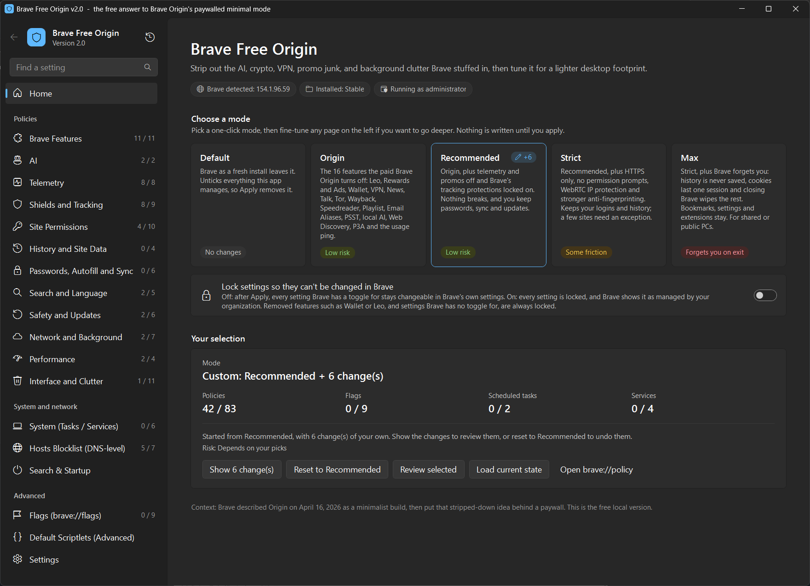

# Brave Free Origin (v2.0)


`Brave Free Origin` is a Windows GUI tool that turns normal Brave into a leaner, stripped-down build without paying for Brave Origin.

The point is simple: Brave took the "remove the AI, crypto, VPN, promo junk" idea, called it Origin, and put it behind a paid upgrade. This project does the local Windows policy version of that idea for free, and then goes further with extra performance-focused modes.

It is inspired by [MulesGaming/brave-debullshitinator](https://github.com/MulesGaming/brave-debullshitinator), but reshaped into a native-feeling Windows app with one-click modes, backups, and a more normal Windows-user flow.



**New in v2.0:** every setting was checked against the Brave and Chromium source code. Dead settings are gone, missing ones were added, and the modes were rebuilt: Default, an exact copy of Brave Origin, Recommended, Strict and a Max mode that forgets you when Brave closes. There is a new Flags page for a few long-lived brave://flags entries, and the Home page warns you when something you applied stopped being in effect. [CHANGELOG.md](CHANGELOG.md) has the details. The interface is translatable; see [TRANSLATING.md](TRANSLATING.md) if you want to add your language. It is one JSON file, no PowerShell required.

---

## Quick Start (read this first)

**1. Extract the whole folder out of the ZIP.** Don't try to run anything from inside the ZIP — Windows blocks PowerShell scripts launched from compressed archives.

**2. Double-click `Brave-Free-Origin.bat`.**

That is the launcher. It opens PowerShell with the right execution-policy flag and asks Windows for administrator permission.

> ⚠️ **Important:** do **not** double-click `Brave-Free-Origin.ps1` directly. Windows opens `.ps1` files in Notepad by default — the GUI will *not* appear and you will think the tool is broken. **Always use the `.bat`.**

**3. Click "Yes" on the UAC prompt.** Admin rights are required because the tool writes to `HKEY_LOCAL_MACHINE\Software\Policies\BraveSoftware\Brave` — the same place corporate IT writes group policies. No admin = no policies = nothing happens.

**4. The app opens on Home and reads what this PC already has.** It does that in the background, so the window is usable right away; within a second or two every switch shows the current state. Home names what it found: a mode when this PC matches one exactly, otherwise the mode you last applied (or the closest one) with a count, such as "Custom: Recommended + 4 changes". `F5`, or `Load current state` on Home or in Settings, reads it again.

**5. Pick a mode** from the cards on the Home page:

| Card            | What it does                                                                                                                                                                                                                 |
| --------------- | ---------------------------------------------------------------------------------------------------------------------------------------------------------------------------------------------------------------------------- |
| **Default**     | Brave as a fresh install leaves it. Turns every switch off, so `Apply to Brave` removes everything this app set.                                                                                                             |
| **Origin**      | A copy of the paid Brave Origin: the same 16 features turned off (Leo, Rewards and Ads, Wallet, VPN, News, Talk, Tor, Wayback, Speedreader, Playlist, Email Aliases, PSST, local AI, Web Discovery, P3A and the usage ping). |
| **Recommended** | Origin, plus telemetry and promos off and Brave's tracking protections locked on. Nothing breaks, and you keep passwords, sync and updates.                                                                                  |
| **Strict**      | Recommended, plus HTTPS only, no permission prompts, WebRTC IP protection, Cast off and three anti-fingerprinting flags. Keeps your logins and history; a few sites need an exception.                                       |
| **Max**         | Strict, plus Brave forgets you: history is never saved, cookies last one session, and closing Brave wipes cookies, cache, saved passwords and autofill. Bookmarks, settings and extensions stay. For shared or public PCs.   |

Each mode builds on the one before it. No mode touches Brave's updates: the `System` page and the component-update hosts group are for manual use only.

Picking a mode only changes the switches. Nothing is written until you apply.

**6. (Optional) Fine-tune.** Every policy category, `System (Tasks / Services)`, `Hosts Blocklist` and `Search & Startup` has its own page in the side navigation, with a count of what is switched on. Click anywhere on a setting card to flip it. As soon as something is not applied yet, a bar slides up at the bottom with the count and **Discard**, **Preview changes** and **Apply to Brave**; Discard puts every switch back to what this PC has. Changing switches after picking a mode shows as, for example, "Custom: Origin + 3 changes": the mode's card on Home gets a Modified badge, **Show changes** lists just the differences, and **Reset to Origin** undoes them. The back arrow at the top left (or `Alt+Left`, or the mouse's back button) returns to the pages you came from, and the Activity log button sits next to it.

There is also a `Default Scriptlets (Advanced)` page. That is a separate optional tool for viewing Brave's built-in adblock scriptlet rules and manually disabling selected ones. Presets and the big `Apply to Brave` button never touch it.

**6a. Decide whether Brave may change them later.** Under the mode cards on Home is **Lock settings so they can't be changed in Brave**, off by default. Off, every setting that has a toggle in Brave's own settings stays changeable there after Apply: apply once and forget about the app, and if you want spellcheck or the password manager back, flip it in Brave. Turn it on for a shared or family PC, and every setting is locked the way an IT department would lock it. Removed features (Rewards, Wallet, VPN, News, Talk, Leo) and settings Brave has no toggle for are always locked, because Brave only obeys those as a lock and has nothing to flip anyway. Each setting card says which it will be: **Changeable in Brave after Apply** or **Locked in Brave**.

**7. Click `Preview changes`** in the bottom bar before applying. It opens on **What will happen**: the changes in plain language, grouped by what they do (features removed, less data sent, faster and lighter, and so on), with warnings for side effects such as Brave no longer updating itself or sync turning off. **Technical details** has the exact registry values that will be added, changed or cleared. Nothing is written from Preview.

**8. Click `Apply to Brave`** (bottom right). Then **fully close and reopen Brave**: running tabs need a restart to pick up the new policies. Flags, and the settings that stay changeable in Brave, are written into Brave's own files (Local State and each profile's Preferences), which Brave rewrites when it closes, so they can only be applied while Brave is closed. If it is running, Apply asks whether to apply everything else now and leave those for the next Apply.

**8a. Watch for the warning on Home.** Every Apply remembers what it set. When the app opens, it compares that with the PC and shows a warning on Home if something changed back (a Brave update, another tool, a hand edit) or if Brave no longer supports a setting. **Re-apply** writes the reverted settings again, **Clean up** removes the ones Brave dropped, and **Keep as is** accepts the current state. A setting that is re-applied and then undone again is marked as something that keeps changing it back, such as another tweak tool or a Group Policy.

**8b. (Optional) Find a setting.** Type in **Find a setting** at the top of the side navigation, or press `Ctrl+F`. It searches every policy, task, service and hosts group on every page at once, by name, description, category or domain: `password`, `telemetry`, `BraveVPNDisabled`. Matches show as one list grouped by page, and they are the real settings, so flipping one there flips it on its own page too. Turn on **Selected only** to see just what is switched on, or use **Review selected** on Home after picking a mode to see exactly what that preset is about to enforce. `Esc` clears the search. `Search & Startup` and `Default Scriptlets` are not part of it; the scriptlet page has its own search box, built for tens of thousands of rules.

**9. (Recommended)** Open **Settings** and click `Verify`. It reads the registry and Brave's own settings back and confirms your selections actually landed. You can copy or save the report. Or open `brave://policy` and check that each policy shows `Source: Platform` and `Status: OK`, with `Level: Mandatory` for locked settings and `Level: Recommended` for the ones you can change in Brave.

### Changing the language

Open **Settings** and pick a **Language**. The change is live, with no restart, and is remembered in `%LOCALAPPDATA%\Brave-Free-Origin\settings.json`.

The app currently ships in English only. When a translation is added to `locales/`, you can also force it from the command line, which is handy for testing:

```powershell
.\Brave-Free-Origin.ps1 -Lang de-DE
```

If you never touch the picker, the app follows your Windows display language. Resolution order is: `-Lang`, then the saved preference, then the Windows UI culture, then a same-language file, then English.

The same-language step will not cross writing systems: for Chinese, a Simplified file is never served to a Traditional Chinese Windows, which stays in English instead. You can always pick any installed language in Settings.

Diagnostic output stays in English on purpose: the Activity log, the **Preview changes** report and the **Verify** report. That way a translated install still produces bug reports the maintainer can read. A handful of on-screen strings are also deliberately untranslated (policy names, scheduled task and service names, registry paths, domains, URLs, raw filter rules and scriptlet identifiers), because they are things you cross-check against `brave://policy`, `services.msc` or Brave's own filter lists.

### Theme

By default the app follows Windows' light or dark app mode, including the title bar on Windows 11. The accent is always Windows' default blue. **Settings** > **Theme** can pin Light or Dark instead; the choice is remembered in the same `settings.json`.

### Files in this folder

```
Brave-Free-Origin/
├── Brave-Free-Origin.bat   ← double-click THIS one
├── Brave-Free-Origin.ps1   ← never double-click this (opens in Notepad)
├── README.md               ← you are here
├── CHANGELOG.md            ← what changed in each version
├── TRANSLATING.md          ← how to add a language
├── LICENSE
├── src/                    ← the app's code, loaded by the .ps1 (keep it)
├── tweaks/                 ← every setting the app can change, as plain data (keep it)
├── locales/
│   └── en-US.json          ← generated reference, never loaded at runtime
└── images/
    ├── screenshot.png      ← GUI preview shown above
    ├── Brave-before.png    ← memory comparison: before
    └── Brave-after.png     ← memory comparison: after
```

Keep `src/` and `tweaks/` next to the launcher: if either is missing, the app shows which files it needs and does not start. Deleting `locales/` is harmless, because the English text ships inside `src/`, so the app simply runs in English.

The launcher (`.bat`) is essentially one line: it runs the PowerShell script with `-ExecutionPolicy Bypass`. That bypass is scoped only to that single launch — it does **not** weaken your machine's PowerShell policy.

---

## Changelog

What changed in each version, newest first, is in [CHANGELOG.md](CHANGELOG.md).

---

## What It Does

The app writes Brave enterprise policies to:

`HKLM\Software\Policies\BraveSoftware\Brave`

That means it is not just hiding buttons visually. It is using the same managed-policy system organizations use to disable features in Chromium-based browsers.

Policies there are mandatory: Brave applies them and greys the setting out. Settings that should stay changeable in Brave go to the `Recommended` subkey instead, which Brave treats as a starting value the user can change, and Apply also writes the value into Brave's own settings files (each profile's `Preferences` and the channel's `Local State`) so it takes effect over anything stored earlier. Only the values the app manages are touched; every other byte of those files is written back exactly as it was read.

### About the "Managed by your organization" note

Because this tool writes real enterprise policies under `HKLM\Software\Policies\BraveSoftware\Brave`, Brave will show a **"Managed by your organization"** entry in its menu and on `brave://management` for as long as any policy is applied. With **Lock settings** off, that is a notice in the menu only: the settings themselves stay changeable. Removed features such as Wallet and Leo are always locked policies, so the notice stays while any of them is applied. This is a Chromium transparency feature: any browser with active machine-level policies shows it. There is **no supported way to keep the policies but hide the note**: Brave declined to add one, so attempting to force it off would mean unsupported hacks that can break the policy system. The only clean way to remove the note is to remove the policies (untick everything and Apply, or use the built-in reset/restore). This is by design, not a bug.

Every Brave channel (Stable, Beta, Nightly, Dev) reads this one key, so they all get the same policies. The few brave://flags entries on the Flags page are written to each installed channel's own Local State instead.

It can disable or reduce:

- Leo and Brave's on-device AI models
- Brave Rewards and Brave Ads
- Brave Wallet
- Brave VPN, Brave News, Brave Talk, Email Aliases, PSST
- Playlist, Speedreader, Tor windows, the Wayback Machine prompt
- P3A analytics, the usage ping, Web Discovery, usage and crash reports
- background mode, link preloading, casting, WebRTC local IP exposure
- permission prompts: notifications, location, sensors, USB, Bluetooth, HID, serial ports, local fonts
- first-run import offers, promotions and other clutter
- browsing history, cookies and site data, if you want Brave to forget you (Max mode)
- Brave update tasks and services, by hand on the System page (no mode does this)

It can also tune Brave:

- hardware acceleration and QUIC (HTTP/3): pick Enable or Disable from the picker next to the switch (disabling hardware acceleration helps with buggy GPU drivers)
- Memory Saver and Energy Saver on
- a disk cache cap
- the search engine, new tab page, homepage and startup behavior, on the Search & Startup page

Each setting says whether ticking it changes Brave's default or keeps Brave's default, whether it stays changeable in Brave after Apply or is locked, and settings the installed Brave is too old for are greyed out.

v1.9 also adds an optional advanced scriptlet manager. It can view and manually disable Brave's built-in adblock scriptlet rules in component filter lists. This is intentionally separate from the normal policy system and is only for users who choose to open the advanced page and accept the warnings.

### Advanced scriptlet manager notes

The `Default Scriptlets (Advanced)` page is not part of the normal preset/apply flow. The one-click modes, policy pages, config import, and big `Apply to Brave` button do not edit Brave's internal filter-list files.

To bulk-disable matching scriptlets:

1. Open `Default Scriptlets (Advanced)`.
2. Click `Scan` and wait for it to finish. The window stays usable while it scans, and `Cancel` stops it.
3. Type in the search box if you only want a subset, such as `youtube`.
4. Leave `Show disabled by this app only` off if you want active rules included.
5. Turn on `Advanced edit mode`.
6. Click `Check filtered`.
7. Confirm the status line shows the expected `Checked:` count.
8. Click `Disable checked`.

Disabling scriptlets is not the same as disabling Brave adblocking. Scriptlets are only the `##+js(...)` injected-rule layer used for site fixes, anti-annoyance behavior, cookie banners, video workarounds, and some anti-adblock handling. Brave can still block ads through network filters, cosmetic filters, and Shields even when scriptlets are disabled.

## Before / After

These screenshots are included in the project folder and show the exact comparison you added.

In your example, `Brave Browser (7)` drops from about **305.7 MB** to **222.4 MB** in Task Manager after optimization.

### Before


### After


## Important Windows Notes

### Administrator rights

This app writes under `HKLM`, so admin rights are required. That is normal. The PowerShell script auto-elevates, and the BAT launcher warns you about the UAC prompt.

### Execution policy

You do **not** need to change your system PowerShell execution policy.

The launcher already starts PowerShell like this:

```powershell
powershell.exe -NoLogo -NoProfile -ExecutionPolicy Bypass -File ".\Brave-Free-Origin.ps1"
```

That bypass applies only to that launch of the script. It does not permanently weaken your machine's policy.

The script accepts two optional parameters, both forwarded across the UAC
prompt: `-Lang <locale>` to force a UI language, and `-BfoSettingsPath <path>`
to point it at a different settings file.

### SmartScreen / "Windows protected your PC"

If Windows shows SmartScreen because this is a local script you made or downloaded:

1. Click `More info`
2. Click `Run anyway`

Only do that if you trust this copy and know where it came from.

### "This file came from another computer"

If you downloaded the project and Windows blocks it:

1. Right-click `Brave-Free-Origin.bat` or `Brave-Free-Origin.ps1`
2. Click `Properties`
3. If you see `Unblock`, tick it
4. Click `Apply`

If needed, do the same for the whole extracted folder contents.

### Defender / antivirus warning

Registry-editing tools, batch files, and PowerShell launchers can look suspicious to Windows security tools even when they are harmless. That is expected behavior for a tweak utility. Read the script if you want to verify exactly what it does.

## Manual Launch

If the BAT file is not working for some reason, open PowerShell in the project folder and run:

```powershell
powershell.exe -NoLogo -NoProfile -ExecutionPolicy Bypass -File ".\Brave-Free-Origin.ps1"
```

If PowerShell says access is denied, the usual causes are:

- the folder is still inside a ZIP
- the file is blocked by Windows
- you refused the UAC elevation prompt
- another program is locking the file in OneDrive

## How To Verify It Worked

After applying settings and restarting Brave:

1. Open `brave://policy`
2. Look for the policies you selected
3. Check that each relevant policy shows:

- `Source: Platform`
- `Scope: Machine`
- `Status: OK`

Then do a real-world check:

- Leo should be gone or disabled
- Rewards / Wallet / VPN / News UI should be reduced or removed depending on mode
- `brave://flags` should show the flags you applied as Enabled or Disabled
- update services and tasks are only disabled if you did it yourself on the System page

The in-app `Verify` report can be copied or saved to a text file. That is useful if Brave's UI still looks wrong but `brave://policy` says the registry policy is applied correctly.

## Restore / Undo

Before every change, the app takes a full backup of everything it can change: the Brave policy key, the hosts block, each channel's flags, the update tasks and services, and the record of the last apply. Backups go to:

`%USERPROFILE%\Documents\Brave-Free-Origin-Backups\backups\`

To go back to an earlier state:

1. Open **Settings** and scroll to **Backups**
2. Find the backup by its date and reason (for example "Before Apply")
3. Click `Restore`

The restore takes a backup of the current state first, so it can be undone the same way. Close Brave before restoring if you want its flags restored too; channels that are running keep their current flags. `Pin` keeps a backup from being cleaned up: the newest 20 automatic backups are kept, and pinned ones and the ones you made with `Back up now` are never removed. Automatic backups can be turned off with **Back up automatically before every change** in **Settings** > **Where changes go**.

To preview a change before committing it:

1. Pick a mode, or flip individual switches
2. Click `Preview changes`
3. Review the report
4. Click `Apply to Brave` only if it looks right

To fully restore stock behavior:

1. Re-run the app and open **Settings**
2. Click `Full restore / stock`

That removes the Brave policy key, the flags this app manages (for every channel that is closed), the Brave-Free-Origin hosts block and the record of the last apply, re-enables Brave update tasks, and resets disabled Brave services to Manual.

For a lighter revert:

1. Use the `Default` mode
2. Click `Preview changes`
3. Click `Apply to Brave`

Or, by hand without the app:

1. Double-click `policies.reg` inside a backup folder to put the policy key back (delete `HKLM\Software\Policies\BraveSoftware\Brave` first if you want an exact copy)
2. For flags, close Brave and copy `local-state-<channel>.json` back over that channel's `User Data\Local State`

Or:

1. Use the `Remove hosts block` button on the Hosts page to clear only the DNS-level blocklist

Or, for advanced scriptlet edits only:

1. Open `Default Scriptlets (Advanced)`
2. Scan your Brave `User Data` folder
3. Turn on `Advanced edit mode`
4. Use `More` > `Restore selected file` or `Restore all backups`

Scriptlet restores use the local `list.txt.bfo-backup` files created beside Brave's component filter lists.

## Caveats

- `Origin` turns off the same 16 features as the paid Brave Origin, through Windows policies rather than a separate Brave build. Real Origin leaves 7 of them (the usage ping, P3A, local AI, Wayback, Speedreader, Playlist, Web Discovery) changeable in `brave://settings`. With **Lock settings** off, so does this app for six of them; local AI has no toggle in a normal Brave, so it stays locked. The Origin build also hides the sidebar by default, which has no policy.
- `Max` wipes data every time Brave closes. It only does that when Brave exits normally; session-only cookies cover a crash. Do not use it on a PC where you want to stay logged in.
- `Strict` blocks permission prompts and plain-HTTP sites by default. Give a site an exception in its site settings or Shields when it needs one.
- Turning off component updates (the policy, or the Component Updates hosts group) freezes Shields filter lists and can break Widevine playback such as Netflix or Spotify.
- Disabling built-in Brave scriptlets can break adblocking, anti-annoyance fixes, cookie banners, video playback, or site compatibility. Use the scriptlet manager only when you know which rule you are changing.
- Brave can replace component filter-list versions during updates. Export disabled scriptlet preferences if you want to reapply the same raw-rule disables after an update.
- Some Brave-side UI bugs can leave elements visible even when the policy is correctly applied. In that case, trust `brave://policy` first.

## File Layout

```text
Brave-Free-Origin/
├── Brave-Free-Origin.bat     # UAC-elevating launcher  ← double-click THIS
├── Brave-Free-Origin.ps1     # Entry point: elevates, loads src/ in order, shows the window
├── README.md                 # this file
├── CHANGELOG.md              # what changed in each version
├── TRANSLATING.md            # how to add a language
├── LICENSE
├── src/                      # the app's code (.ps1 and .xaml, ASCII only)
│   ├── core/                 #   logic: registry, hosts, flags, presets, preview, apply, drift, scriptlets
│   ├── strings/en-US.ps1     #   English string catalog, the runtime source of truth
│   └── ui/                   #   the WPF window: theme, view model, background jobs, pages; xaml/ holds the layout
├── tweaks/                   # what the app can change, as plain data (see tweaks/README.md)
│   ├── policies/             #   one .psd1 per policy page
│   ├── flags.psd1            #   brave://flags entries on the Flags page
│   ├── retired.psd1          #   policies earlier versions wrote, which Apply removes
│   ├── system.psd1           #   Brave update tasks and services
│   ├── hosts.psd1            #   hosts blocklist groups
│   ├── search.psd1           #   search engines, new tab targets, startup modes
│   └── presets.psd1          #   what each one-click mode ticks
├── locales/                  # UI translations, read as UTF-8 at runtime
│   └── en-US.json            #   generated reference, never loaded
├── tools/                    # maintainer scripts, not shipped to users
│   ├── Export-EnglishLocale.ps1
│   ├── Test-Locales.ps1
│   ├── Test-Tweaks.ps1
│   └── known-policies.psd1   #   policy names verified against the Chromium and brave-core sources
└── images/
    ├── screenshot.png        # GUI preview
    ├── Brave-before.png      # Memory comparison: before
    └── Brave-after.png       # Memory comparison: after
```

To add or change a policy, task, service, hosts group, search engine or mode, edit the matching file in `tweaks/`; [tweaks/README.md](tweaks/README.md) has the field reference and the checks to run. The load order in `Brave-Free-Origin.ps1` is the map of the code: `core` first, then the English strings, then `ui`: theme, view model, background jobs, dialogs, the window itself, and the code behind each page.

Backups land here:

```text
%USERPROFILE%\Documents\Brave-Free-Origin-Backups\
├── backups\
│   └── YYYYMMDD-HHMMSS-fff\             # one folder per backup, named by when it was taken
│       ├── backup.json                  # what triggered it, whether it is pinned, and the
│       │                                #   hosts block, flags, tasks, services and apply record
│       ├── policies.reg                 # the whole Brave policy key (missing if there was none)
│       └── local-state-<channel>.json   # each installed channel's Local State
└── brave-free-origin-export-YYYYMMDD-HHMMSS.json   # Export everything (the default save folder)
```

Backups from v1.x (`brave-policies-backup-*.reg`, `hosts-backup-*.bak` and `local-state-*.json` directly in this folder) are left where they are; the app no longer lists or removes them.

UI preferences (the chosen language and theme) live separately, per user:

```text
%LOCALAPPDATA%\Brave-Free-Origin\settings.json
```

Deleting it just resets the app to following your Windows display language and theme.

The record of the last apply, which the Home page warning compares against, is machine-wide:

```text
%ProgramData%\Brave-Free-Origin\applied.json
```

Deleting it only turns the warning off until the next Apply.

Advanced scriptlet backups are stored beside the Brave component list they protect:

```text
%LOCALAPPDATA%\BraveSoftware\Brave-Browser\User Data\<component>\<version>\list.txt.bfo-backup
```

Disabled scriptlet preference exports are JSON files saved wherever you choose in the save dialog.

`tools/` is maintainer tooling and is deliberately left out of the portable
zip. The zip itself (`Brave-Free-Origin.zip`) is a build output produced by CI
and attached to releases — it is not a tracked file in this repository.

### Exported config format

`Export everything` writes schema **4**:

```jsonc
{
  "schemaVersion": 4,          // the file format
  "appVersion": "2.0",         // the app that wrote it - moves independently
  "exported": "2026-09-27T14:03:11",
  "profile": "Custom",         // stable mode id, never the translated label
  "baseProfile": "Recommended",  // the mode a Custom selection started from
  "policies":     { "BraveVPNDisabled": true },
  "policyValues": { "HardwareAccelerationModeEnabled": 1 },
  "flags":        { "brave-round-time-stamps": false },
  "tasks":        { "BraveSoftwareUpdateTaskMachineCore": true },
  "services":     { "brave": false },
  "hosts":        { "p3a": true },                    // stable group id
  "search":  { "enabled": false, "engineId": "brave",      "customUrl": "" },
  "ntp":     { "enabled": false, "destinationId": "blank", "customUrl": "" },
  "home":    { "enabled": false, "destinationId": "blank", "customUrl": "" },
  "startup": { "enabled": false, "modeId": "newTab",       "urls": "" },
  "app":        { "language": "en-US", "theme": "system", "backup": true },
  "scriptlets": { "disabledRules": [ "example.com##+js(some-scriptlet)" ] }
}
```

`schemaVersion` only changes when the *format* changes, so a normal app release does not invalidate your saved configs. Schema 4 added `baseProfile`, `app` and `scriptlets`. Schema 3 added `flags` and `home` and dropped `channel`. Older files still import: v1.5 to v1.11 used English display text where later schemas use ids (`"Brave P3A telemetry"` instead of `"p3a"`, `"Open the new tab page"` instead of `"newTab"`, and so on), old mode ids map onto today's modes (never onto Max), and a policy saved under an old name, such as `MediaRouterEnabled`, lands on the setting that replaced it. Because nothing in the file depends on display text, a config imports identically whatever language the UI is in.

## Platform Compatibility

Brave Free Origin is Windows-only: it's a WPF app that writes to HKEY_LOCAL_MACHINE\Software\Policies\BraveSoftware\Brave.

For macOS, there's an unofficial companion project:

[Johnny-Kao/brave-free-origin-macos](https://github.com/Johnny-Kao/brave-free-origin-macos) — applies the same category of Brave enterprise policies via macOS Managed Preferences (/Library/Managed Preferences/com.brave.Browser.plist) instead of the Windows Registry.


It's independently written and maintained, not a fork of this project, and not officially supported here — check its own README for usage and caveats.


## Sources

- [Brave Help Center - Group Policy](https://support.brave.com/hc/en-us/articles/360039248271-Group-Policy)
- [Brave Help Center - What is Brave Origin?](https://support.brave.app/hc/en-us/articles/38561489788173-What-is-Brave-Origin)
- [brave-core policy definitions](https://github.com/brave/brave-core/tree/master/components/policy/resources/templates/policy_definitions/BraveSoftware)
- [Chrome Enterprise Policy List](https://chromeenterprise.google/policies/)
- [brave-core browser/about_flags.cc](https://github.com/brave/brave-core/blob/master/browser/about_flags.cc) (brave://flags) and [Brave Origin's policy list](https://github.com/brave/brave-core/blob/master/browser/brave_origin/brave_origin_service_factory.cc)
- Original [MulesGaming/brave-debullshitinator](https://github.com/MulesGaming/brave-debullshitinator)
